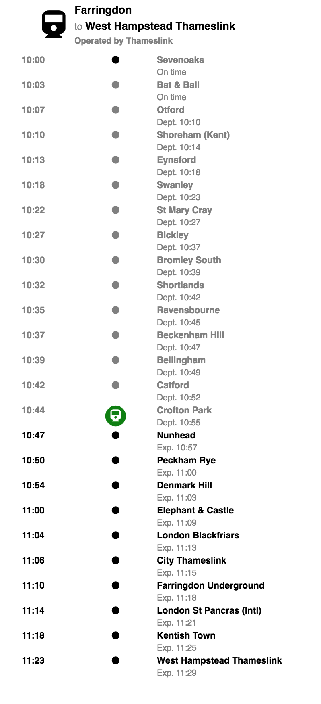

# Trainline Test

## Things I've done
- Coded an outstanding small React-Redux App
- Added unit tests for the main components and actions
- Implemented redux ecosystem
- Added middleware (redux-thunk) to allow async actions
- Added a small api to connect asynchronously with the fake server 

## Things I wish I could have done
- Add a better styling
- Make the style pixel perfect
- Follow a TDD approach

## Making it work
- Clone repo: `$ git clone https://github.com/trepafi/trainline-test`
- Install dependencies `$ npm i`
- Start server `$ npm start`
- Run tests `$ npm test`

## TODO
- [ ] Add tests for reducers
- [ ] Add tests for containers
